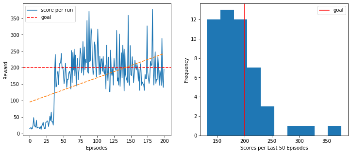

# Deep Q-Learning to solve the CartPole environment

This project aims to train an agent to solve the CartPole environment from the OpenAI Gym using Deep Neural Network in Reinforcement Learning.

It was an exercise from the **2022 [42AI](https://github.com/42-AI) & [PoC](https://www.poc-innovation.fr/) Deep Learning Pool**. 
The original subject and completed notebook (by [Nell Fauveau](https://github.com/Nellousan)) are in `notebook`

## Use

```
git clone https://github.com/MCCiupek/DQL-CartPole.git
cd DQL-CartPole
pip install -r requirements.txt
cd src
python main.py [-r|--render]
```

Use flag ``-r`` or ``--render`` to visualize 5 games played by the trained agents.

**Warning:** rendering requires ``OpenGL``.

## Environment

The [CartPole environment](https://gym.openai.com/envs/CartPole-v1/) consists of a pole which moves along a frictionless track. The system is controlled by applying a force of +1 or -1 to the cart. The pendulum starts upright, and the goal is to prevent it from falling over. The state space is represented by four values: cart position, cart velocity, pole angle, and the velocity of the tip of the pole. The action space consists of two actions: moving left or moving right. A reward of +1 is provided for every timestep that the pole remains upright. The episode ends when the pole is more than 15 degrees from vertical, or the cart moves more than 2.4 units from the center.


## Algorithm

In this exercice a modified version of the [Bellman Equation](https://en.wikipedia.org/wiki/Bellman_equation) (adapted for deterministic envrironments) will be used.

Bellman Equation:

$
Q(S_t, A_t) = (1 - \alpha)Q(S_t, A_t) + \alpha(R_t + \lambda * max_{\alpha}Q(S_{t+1}, \alpha))
$

This Q-function will be approximated by a deep neural network with memory replay. This neural network will be responsible for evaluating states, i.e. determine the expected reward of each action at a given state.

Our neural network is composed of 2 fully connected layers and an output layer. The 2 first layers use [ReLU](https://en.wikipedia.org/wiki/Rectifier_(neural_networks)) for the activation function.

## Training results

After less than 50 episodes over 200, the agent managed to achieve the winning threshold of 200 and remain at this level.

